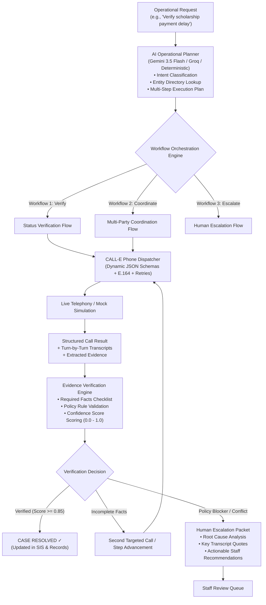

# CampusOps AI
**Autonomous Phone Operations for Higher Education & Large Institutions**

[](https://heycall-e.com)
[]()
[]()

CampusOps AI is an **Autonomous Phone Operations Orchestrator** built on **CALL-E**. Instead of a basic callback system or rigid dead-end IVR tree, CampusOps AI plans operational tasks, resolves contacts from institutional directories, conducts structured phone conversations with relevant authorities, validates extracted evidence against strict policy checklists, negotiates multi-party scheduling consensus, and safely escalates unresolvable exceptions to human administrators.

Reference institutional deployment: **Namibia University of Science and Technology (NUST)**, Windhoek.

---

## The Paradigm Shift: From Callbacks to Operations

| Traditional Telephony | Standard AI Phone Bots | CampusOps AI |
|:---|:---|:---|
| **Endless Hold Times**: Students wait 45+ minutes on phone queues. | **Single-Turn Calls**: Places one call, logs a flat text summary, and stops. | **Autonomous Orchestration**: Gathers facts, plans execution steps, and calls the exact offices responsible. |
| **Repetitive Storytelling**: Students re-explain their situation to 4 different departments. | **No Fact Verification**: Assumes any completed call is a success without policy validation. | **Evidence Verification Loop**: Validates required fields, checks confidence thresholds ($\ge 85\%$), and verifies facts before resolution. |
| **Dead-End IVR Menus**: Press 1, Press 2 loops with no context persistence. | **Single Stakeholder**: Unable to negotiate agreements between multiple participants. | **Multi-Party Coordination**: Sequentially contacts Student $\leftrightarrow$ Faculty Advisor $\leftrightarrow$ Department Office until consensus is reached. |
| **Silent Failures**: Unresolved calls are dropped with zero staff action items. | **Hallucinatory Agreements**: AI promises things it lacks authority to execute. | **Structured Human Escalation**: Assembles root-cause analysis, transcript quotes, and actionable recommendations for staff. |

---

## System Architecture



---

## The Three Core Workflows

### 1. Workflow 1 — Autonomous Status Verification (`verification`)
- **Use Case**: Scholarship disbursements, financial aid holds, academic clearance, enrollment validation.
- **Workflow**:
  1. Identifies student record and targets the responsible institutional authority (e.g. Financial Aid Bureau).
  2. CALL-E executes outbound call using `SCHOLARSHIP_VERIFICATION_SCHEMA`.
  3. Extracts structured facts: `application_status`, `payment_status`, `expected_date`, `additional_action_required`.
  4. Post-call Verification Engine checks evidence checklist. If complete and confidence $\ge 85\%$, resolves operation.

### 2. Workflow 2 — Multi-Party Coordination (`coordination`)
- **Use Case**: Academic advising panels, prerequisite waiver hearings, committee meeting scheduling.
- **Workflow**:
  1. **Step 1 (Student)**: Calls student to negotiate candidate meeting times.
  2. **Step 2 (Faculty Advisor)**: Calls advisor to confirm candidate slot availability.
  3. **Step 3 (Department Office)**: Calls department admin to reserve the meeting room.
  4. **Consensus**: Confirms reservation across all 3 parties and updates records.

### 3. Workflow 3 — Human Escalation & Exception Triage (`escalation`)
- **Use Case**: Missing physical affidavits, policy blockers, sensitive disciplinary or legal inquiries.
- **Workflow**:
  1. Intercepts sensitive requests or evaluates verification failures.
  2. Compiles a comprehensive **Escalation Packet**:
     - Assigned office & named contact
     - Root-cause gap analysis
     - Transcript citations
     - 3 concrete recommended actions for university staff.

---

## How CALL-E is Integrated

- **Centralized Client (`app/calle/client.py`)**: Wraps CALL-E Developer REST API (`POST /v1/calls`, `GET /v1/calls/{id}`).
- **Dynamic Recipient Schemas (`app/calle/schemas.py`)**: Enforces typed extraction (`SCHOLARSHIP_VERIFICATION_SCHEMA`, `COORDINATION_SLOT_SCHEMA`).
- **Defensive Response Parser (`app/calle/results.py`)**: Built and tested directly against real completed `get_call_run` payloads.
- **Transient Retry Handling**: Automatic exponential backoff for HTTP 429 rate limits, 5xx server issues, and network blips.
- **Deterministic Mock Transport (`_MockTransport`)**: Out-of-the-box dry-run support with realistic scenarios without incurring paid call charges during development and CI.

---

## Safety, Privacy & FERPA Compliance

1. **Strict Non-Disclosure Boundaries**: Identity must be confirmed before discussing any account details. Protected attributes (student ID numbers, birthdates, disability statuses, residential addresses) are never spoken aloud over phone lines.
2. **Third-Party Restrictions**: If a caller is a parent, sponsor, or third party, the agent politely declines disclosure and directs them to have the student contact the office directly.
3. **E.164 Number Validation**: Strict formatting enforced on all inputs (e.g., `+264811234567`).
4. **Staff Manual Override**: University administrators can divert, reassign, or mark any active operation handled at any time from the Command Center.

---

## Quickstart & Local Setup

### 1. Backend Setup (FastAPI)

```bash
# Clone and enter directory
cd CampusOps-AI

# Initialize and activate virtual environment
python -m venv .venv
.venv\Scripts\activate        # Windows (.venv/bin/activate on macOS/Linux)

# Install dependencies
pip install -r requirements.txt

# Seed student & institutional directory
python scripts/seed_students.py --target sqlite

# Run backend server
uvicorn app.main:app --reload --port 8000
```

### 2. Frontend Setup (React + Vite)

```bash
cd web
npm install
npm run dev
```

Visit `http://localhost:5173` for the **1-Click Launchpad**, and `http://localhost:5173/dashboard` for the **Operations Command Center**.

---

## Running Automated Tests

CampusOps AI comes with a comprehensive test suite covering planning, verification, coordination, and API execution:

```bash
python tests/test_planner.py
python tests/test_verifier.py
python tests/test_escalation.py
python tests/test_workflows.py
python tests/test_parse_call_response.py
```

---

## Production Deployment

- **Backend**: Deployed on **Render** using `render.yaml` with FastAPI + Uvicorn.
- **Database**: **PostgreSQL / Neon** via `DATABASE_URL`.
- **Frontend**: Deployed on **Netlify** using `netlify.toml` with Vite.
- **Telemetry**: UptimeRobot monitor pinging `/health` every 5 minutes.

---

## 3-Minute Demo Pitch

See [docs/demo_script_3min.md](docs/demo_script_3min.md) for the complete presentation guide and timestamped demo walkthrough.
